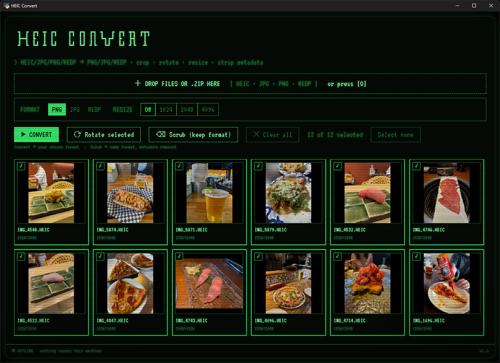
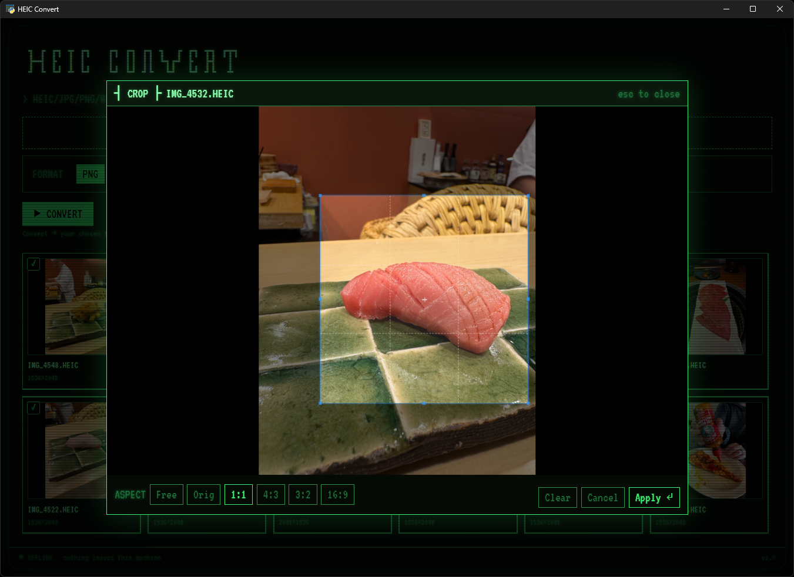
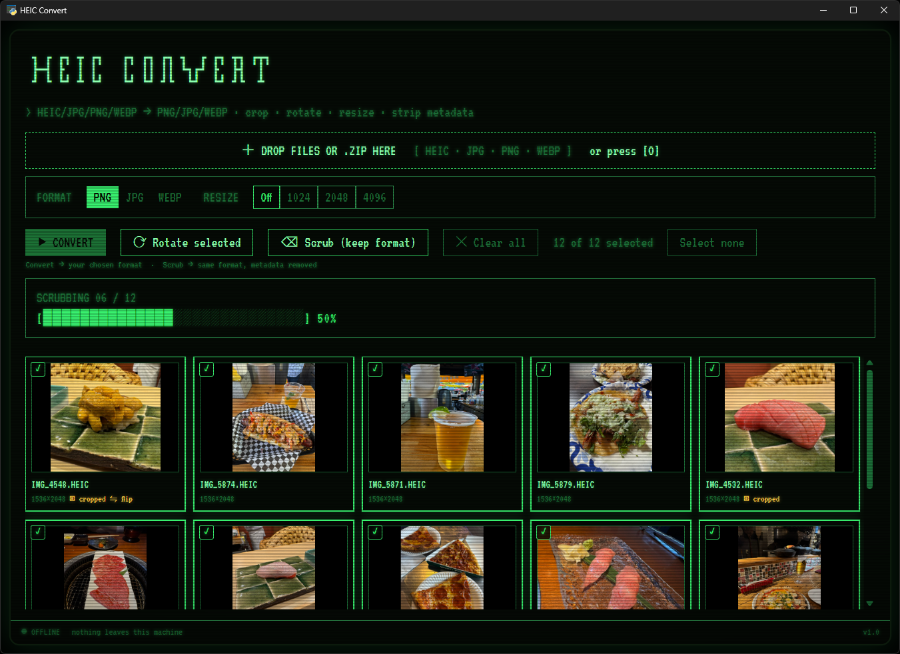

# heic-convert

A retro green-phosphor, DOS-terminal-styled image converter that runs entirely
on your own machine. Drop in your photos, pick a format, and get clean,
metadata-free images back — everything happens locally and offline; nothing
is ever uploaded.



## Features

- **Inputs:** HEIC/HEIF, JPG, PNG, and WebP — or drop a `.zip` full of images
  and it's extracted client-side.
- **Outputs:** PNG, JPG, or WebP. Or use **Scrub** to keep each image's
  original format and just strip its metadata.
- **Batch, with inclusive selection:** drop a whole pile of images at once.
  Everything is selected by default — deselect anything you don't want
  before converting. In the desktop app you choose where they go — a
  Save-As dialog for a single image, or a destination folder for a batch
  (written loose, no zip to unpack). In a browser they download as usual
  (one file, or a `.zip` for a batch).
- **Click-to-preview:** click any thumbnail to open a full preview, with
  per-image **crop**, **rotate**, and **flip**.
- **Optional resize:** cap the longest side at 1024 / 2048 / 4096 px, or
  leave it off — it never upscales.
- **Quality slider:** for JPG/WebP output.
- **Always metadata-free:** EXIF, GPS, and ICC profiles are stripped from
  every output; orientation is baked into the pixels first, and colors are
  converted to sRGB so images look right everywhere.
- **Fully local & stateless:** conversion happens in memory, on your own
  machine. Nothing is uploaded, and nothing is stored server-side.
- **Retro CRT look:** green-phosphor, DOS-terminal styling with an embedded
  pixel font.

## Screenshots

**Per-image editing** — crop (with aspect-ratio presets), rotate, and flip,
in a preview modal:



**Batch conversion** — a retro block progress bar, with `cropped` / `flip`
badges on the edited thumbnails:



## Run it

### Windows (easiest)

1. Download `heic-convert.exe` from the [Releases](../../releases) page.
2. Double-click it — the app opens in its own window (no browser tab, no
   console).

> **Note:** this is an unsigned build, so Windows SmartScreen will show a
> one-time "unknown publisher" prompt the first time you run it. Click
> **More info** → **Run anyway** to continue.

### From source (any OS)

Requires Python 3.12+.

```bash
python3.12 -m venv .venv
source .venv/bin/activate    # Windows: .venv\Scripts\activate
pip install -e .
heic-convert                 # or: python -m heic_convert
```

On Windows this opens the app in its own native window. On other platforms
it serves locally and prints a `http://127.0.0.1:…` URL to open in a browser.

### Self-host on Linux

To run heic-convert persistently on your own Linux box (including as a
systemd service), see [`deploy/README.md`](deploy/README.md).

## Privacy

All conversion happens locally, in memory, on the machine heic-convert runs
on. Your images are never uploaded, never sent to a third-party service, and
never stored by the app — close it and there's nothing left behind.

## Develop / test

```bash
pip install -r requirements.txt
pytest
```

59 tests cover the conversion core, the HTTP API, and the launcher.

## License

MIT — see [LICENSE](LICENSE).

The bundled VT323 font (`static/vendor/VT323-Regular.ttf`) is licensed
separately under the SIL Open Font License; see
[`static/vendor/FONT-LICENSE.txt`](static/vendor/FONT-LICENSE.txt).
